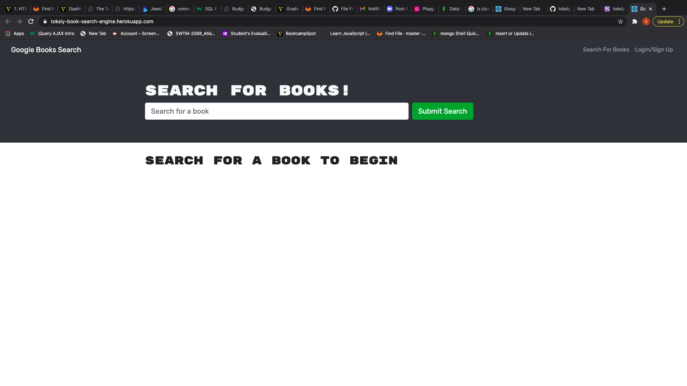

# book-search-engine

## Description

This is a simple application that  gives users the ability to sign up by creating a user name, email address and password for login purposes. While logged in, the user can be able to view his/her collection of saved books. The application also allows users to search for a book even without logging in, while searching, users can use the book title  or author's name.

## Table of Contents

- [Website](#website)
- [Built with](#built-with)
- [Usage](#usage)
- [Contributors](#contributors)
- [Acknowledgements](#acknowledgements)

---

## Website

https://toksly-book-search-engine.herokuapp.com/

---

## Built with

- Javascript
- Graphql
- MongoDB database
- MERN stack

[Back to table of contents](#table-of-contents)

---

## Usage

This application can be accessed via the link to the deployed application. To be able to utilize the full functionality of this application, simply sign up by providing a unique email and a password.

[Back to table of contrents](#table-of-contents)

---

## Contributors

---
---
Sylvester Nwizu
[toksly](https://github.com/toksly)

---
---

[Back to table of contents](#table-of-contents)

---
## Acknowledgements

- [Express.js](https://www.npmjs.com/package/express)
- [apollo-server-express](https://www.npmjs.com/package/apollo-server-express)
- [mongoose](https://www.npmjs.com/package/mongoose)
- [graphql](https://www.npmjs.com/package/graphql)

[Back to Contents](#table-of-contents)

